# CampusIQ — Smart Campus Operations

**From campus data to better decisions.**

CampusIQ is a hackathon-built operational intelligence platform for the
TalTech **DS3 – Ehituse Mäemaja** building. It ingests ~1.4M real sensor
readings, joins them to an IFC4 BIM model of the building, detects anomalies,
evaluates sensor health, produces prioritized and *explainable*
recommendations, and lets planners test space-allocation scenarios against the
building's real design capacity — all from a single spatial view.

> **What this is:** a working end-to-end pipeline (telemetry → baseline →
> anomaly → decision → recommendation) with a live web UI and a 3D digital
> twin. No sensors were installed, no energy savings are claimed, and every
> value in the product carries a stated level of confidence. See
> [Data Integrity & Honest Assumptions](#data-integrity--honest-assumptions).

---

## Table of Contents

- [The Problem](#the-problem)
- [Our Solution](#our-solution)
- [Key Features](#key-features)
- [The Digital Twin](#the-digital-twin)
- [The Intelligence Pipeline](#the-intelligence-pipeline)
- [Explainable Recommendations](#explainable-recommendations)
- [What-If Space Planning](#what-if-space-planning)
- [Data Integrity & Honest Assumptions](#data-integrity--honest-assumptions)
- [Architecture](#architecture)
- [Technology Stack](#technology-stack)
- [API](#api)
- [Project Structure](#project-structure)
- [Running Locally](#running-locally)
- [Testing](#testing)
- [Future Scope](#future-scope)
- [Team](#team)

---

## 🚀 Live Demo

### CampusIQ Web App
[Open CampusIQ](https://campusiq-black.vercel.app)

### CampusIQ Decision API
[Open API](https://campusiq-api-j231.onrender.com)

[API Health Check](https://campusiq-api-j231.onrender.com/api/health)

> The frontend is deployed on Vercel and the FastAPI decision engine is deployed on Render.

## The Problem

Facility and campus teams typically operate in the dark:

- **Telemetry exists but is unused.** Raw sensor streams sit in files; nobody
  turns them into operational insight.
- **BIM is a static drawing.** The building model describes *design intent*
  (capacity, loads, area) but is never combined with what the sensors actually
  report.
- **Alerts without reasoning.** Facility tools say "something looks wrong"
  without explaining what the signal was measured against, or why it matters.
- **Planning by guesswork.** "Can we fit 40 people somewhere?" is answered
  from tribal knowledge, not from the model.

## Our Solution

CampusIQ closes the loop between **what the building is** (BIM) and **what it
is doing** (telemetry):

```
OBSERVE ──▶ DETECT ──▶ UNDERSTAND ──▶ RECOMMEND
  sensor     anomaly    historical    prioritized,
  streams    &          baselines     explainable
             deviation                 actions
```

Plus a **What-If space planner** that answers allocation questions against the
verified BIM capacity of all 115 spaces.

## Key Features

| Feature | What it does |
| --- | --- |
| **Operational Overview** (`/`) | Cinematic dashboard: live telemetry strip, campus pulse (environment / power / sensor health), critical signals, featured recommendation, live 3D twin preview. |
| **Digital Twin** (`/twin`) | Interactive 3D IFC4 model of the building — 115 spaces across 5 storeys, floor switching, per-room inspector with BIM area / volume / height / capacity / design loads. |
| **Intelligence Workspace** (`/intelligence`) | Anomalies, sensor health, forecasts, recommendations (with per-rec evidence chains) and a decision log. |
| **Space Planning** (`/what-if`) | Evaluate space suitability for a capacity + equipment scenario across all 115 spaces. |

## The Digital Twin

The twin is built from the real source model **`DS3_TalTech_V4.ifc`**
(IFC4). A deterministic build step extracts the architectural geometry and
publishes:

- `frontend/public/models/campus_twin.glb` — the 3D model
- `frontend/public/models/twin_manifest.json` — 115 spaces, 5 storeys, per-space
  area / volume / height / global IDs, and an `honesty_note`

In the UI you can:

- Navigate **ALL FLOORS** or a specific storey from the floating toolbar
- **Reset View** / **Top View** camera controls
- Search and select any room from the **BUILDING SPACES** directory
- Inspect a room's **Space Inspector** — area, volume, height, design capacity,
  occupiability, conditioning, and IFC design loads (lighting, power,
  cooling/heating, ventilation)

Every room panel explicitly distinguishes **BIM design data** ("Not measured
operational data") from **operational telemetry**, and states clearly that
sensor→room mapping is **UNRESOLVED** in the current data release.

## The Intelligence Pipeline

All modules live under `scripts/` and run against the ingested telemetry:

1. **Observe** — `ingest_sensor_data.py` normalizes 69 raw CSV channels into a
   validated stream (1,390,297 readings; quality flags
   VALID / MISSING / DUPLICATE / OUT_OF_RANGE / TIME_GAP / SUSPECT).
2. **Understand** — `telemetry_baseline.py` builds time-aware baselines per
   channel (expected value + expected spread) so "normal" is defined for every
   hour of the day.
3. **Detect** — `telemetry_anomaly.py` scores every reading against its
   baseline (z-score family: time-aware, rolling, global, MAD) and flags
   deviations that persist.
4. **Track health** — `telemetry_health.py` monitors stream continuity:
   constant-value detection, irregular sampling, long gaps.
5. **Forecast** — `forecaster.py` produces 1h / 6h / 24h predictions with a
   time-aware seasonal blend and reports coverage, not confidence fabricated
   after the fact.
6. **Decide & recommend** — `decision_engine.py` + `recommendation_engine.py`
   turn the strongest signals into 98 auditable action candidates and 98
   prioritized recommendations (see below).

## Explainable Recommendations

Every recommendation is **not a black box**. Ranking uses a transparent,
deterministic weighted score over factors including:

- **severity** and statistical **deviation** from the time-aware baseline
- **persistence** (how long the signal ran)
- **forecast relevance** (is the condition predicted to continue?)
- **resource relevance** and **actionability**
- **confidence** and **data quality** of the source channel

Each recommendation detail page shows an **Evidence Traceability Chain**
(measurement → baseline → deviation → anomaly → candidate → recommendation)
and a **Technical Diagnostic** block (Recommendation ID, Candidate ID,
Category, Priority Score). No scores are hidden.

> Honesty note included in the produced data:
> *"No measured savings, timetables, or sensor locations are fabricated.
> Impact claims are classified; energy savings remain UNKNOWN until a verified
> intervention model exists."*

## What-If Space Planning

`/what-if` posts an allocation scenario to `/api/allocation/evaluate`:

- **Required capacity** (people)
- **Equipment & fixtures** requirements (checked against the model)
- Optional "declare all rooms available"

The engine evaluates **all 115 rooms** against verified BIM capacity and
returns capacity matches, equipment-verification status, and excluded rooms —
ranking candidates by verified constraints. Anything not verifiable
(e.g. equipment inventory) is explicitly reported as **unverified** rather
than assumed. Each result links straight into its room in the Digital Twin.

## Data Integrity & Honest Assumptions

CampusIQ is deliberately honest about the limits of its data. In the product
and this README we state clearly that:

1. **Sensor→room mapping is UNRESOLVED.** Sensor locations are not attributed
   to specific rooms in the current data release. Telemetry is analyzed per
   channel; it is never falsely claimed to be "room X".
2. **BIM values are design values, not measurements.** All area, volume,
   capacity, lighting, power, and HVAC figures come from the IFC design model.
3. **Ranking is a transparent heuristic**, fully explained and auditable — not
   a black-box ML model, and no ML accuracy claims are made.
4. **What-If evaluates allocation feasibility** against verified constraints;
   it does not simulate HVAC or energy outcomes.
5. **Forecasts are model predictions**, flagged as such in the UI, with
   coverage metadata reported instead of fabricated confidence intervals.
6. **No IoT hardware** was deployed; the pipeline replays the curated dataset
   through the same code path a live feed would use.
7. **No savings, timetables, or URLs are invented.**

## Architecture

```mermaid
flowchart LR
    subgraph Data
        Z[Taltech.zip / Zenodo] --> ING[Ingest & Validate]
        IFC[DS3_TalTech_V4.ifc] --> EX[Extract IFC Spaces]
        ING --> OUT[(output/*.json)]
        EX --> OUT
    end
    subgraph Engine Scripts
        OUT --> BL[Baselines]
        OUT --> AN[Anomalies]
        OUT --> HL[Health]
        OUT --> FC[Forecasts]
        OUT --> DEC[Decision & Recommendation]
    end
    subgraph API
        BL & AN & HL & FC & DEC --> APP[FastAPI api_app :8000]
    end
    subgraph UI
        APP --> FE[React SPA :5173]
        FE --> TWIN[3D Twin Viewer<br/>campus_twin.glb]
    end
    style OUT fill:#1a2332,stroke:#3b82f6
    style APP fill:#0b0f1c,stroke:#22d3ee
    style FE fill:#0b0f1c,stroke:#22d3ee
```



The pipeline is **no-database by design**: every engine stage reads and writes
versioned JSON artifacts under `output/`, and the API serves them in-memory.
That keeps every stage inspectable and every artifact diffable.

## Technology Stack

| Layer | Technology |
| --- | --- |
| Backend API | Python 3 · FastAPI · Uvicorn |
| Data pipeline | Python — pandas/NumPy based analysis modules (baseline, anomaly, health, forecast, decision, recommendation) |
| 3D models | ifcopenshell-driven IFC4 extraction, published as glTF/GLB |
| Frontend | React 19 · TypeScript · Vite 8 · Tailwind CSS v4 |
| 3D rendering | Three.js · React Three Fiber · drei |
| Routing | react-router-dom v7 |
| Testing | Pytest (backend) · Vitest + Testing Library (frontend) |

## API

Base URL: `http://127.0.0.1:8000` (UI proxies `/api` → backend on port 8000).

| Method | Endpoint | Purpose |
| --- | --- | --- |
| GET | `/api/health` | Service health + sensor-health summary |
| GET | `/api/campus` | Campus & storey summary |
| GET | `/api/spaces` | Paginated spaces (storey / occupiable / capacity filters) |
| GET | `/api/spaces/{space_id}/bim-design` | IFC design loads for a space |
| GET | `/api/resources` | Resource state (area, volume, capacity) |
| GET | `/api/telemetry/summary` | Telemetry & anomaly intelligence summary |
| GET | `/api/anomalies` | Paginated, severity-filterable anomaly records |
| GET | `/api/forecasts` | Paginated forecast records |
| GET | `/api/recommendations` | Paginated, filterable recommendations |
| GET | `/api/recommendations/{id}` | Single recommendation + evidence detail |
| GET | `/api/decision-candidates` | Action candidates / decision log |
| GET | `/api/dashboard/summary` | Overview dashboard aggregate |
| POST | `/api/allocation/evaluate` | What-If allocation feasibility |
| GET/POST | `/api/replay/*` | Dataset replay engine (backend; scripting) |

## Project Structure

```
.
├── DS3_TalTech_V4.ifc        # Source IFC4 building model
├── Taltech.zip               # Source telemetry bundle (Zenodo)
├── scripts/                  # Pipeline + API
│   ├── api_app.py            # FastAPI backend (serves output/*.json)
│   ├── ingest_sensor_data.py # CSV → validated telemetry
│   ├── telemetry_baseline.py # time-aware baselines
│   ├── telemetry_anomaly.py  # z-score anomaly detection
│   ├── telemetry_health.py   # sensor health monitoring
│   ├── telemetry_features.py # feature extraction
│   ├── telemetry_intelligence.py
│   ├── forecaster.py         # 1h/6h/24h forecasts
│   ├── decision_engine.py    # action candidates
│   ├── recommendation_engine.py
│   ├── resource_state.py     # BIM resource aggregates
│   ├── linkage_engine.py     # sensor↔space linkage analysis
│   ├── replay_engine.py      # dataset replay (no UI)
│   ├── build_twin.py / build_real_twin.py  # IFC → 3D twin
│   └── extract_ifc_spaces.py
├── output/                   # Generated, versioned data artifacts
├── frontend/                 # React SPA
│   ├── src/pages/            # Overview, DigitalTwin, Intelligence, WhatIf, RecDetail
│   ├── src/components/       # layout, TwinViewer, BimSpacePanel, …
│   └── public/models/        # campus_twin.glb + twin_manifest.json
├── docs/                     # Engineering & pitch documentation
└── tests/                    # Backend pytest suite
```

## Running Locally

**Prerequisites:** Python 3.10+ with `fastapi`, `uvicorn`, `pandas`, `numpy`
(see `scripts/` imports), and Node.js 20+.

```bash
# 1. Backend API (from scripts/)
cd scripts
uvicorn api_app:app --port 8000

# 2. Frontend (from frontend/)
cd frontend
npm install
npm run dev          # http://localhost:5173 (proxies /api -> 127.0.0.1:8000)
```

Production build:

```bash
cd frontend
npm run build        # tsc -b && vite build
npm run preview      # serves dist/ with the same /api proxy
```

Regenerating the 3D twin:

```bash
python3 scripts/build_real_twin.py      # or build_twin.py
```

## Testing

```bash
# Backend (from repo root …/hackathon)
python3 -m pytest tests/ -q      # 124 passing

# Frontend (from frontend/)
cd frontend
npm run vitest                   # 33 passing
npm run typecheck                # tsc type-check
```

## Future Scope

- **Resolve sensor→room mapping** (needs floor-plan coordinates or a room
  register) to enable room-level telemetry attribution.
- **Verified intervention outcomes** — close the loop from recommendation to
  measured savings by tracking real maintenance actions.
- **Live ingest** — swap the replay engine for a real event stream with no
  pipeline changes.
- **BMS integration** — space planning over actual availability and occupancy
  schedules instead of declared availability.
- **Spatial anomaly heatmaps** once mapping is resolved.

## Team

**The Commit Crew**

---

*CampusIQ — Smart Campus Operations. Built for the hackathon on the TalTech
DS3 dataset.*

*Screenshots: `docs/images/overview.png`, `docs/images/digital-twin.png`,
`docs/images/intelligence.png`, `docs/images/what-if.png` (placeholders — add
real captures before final pitch).*